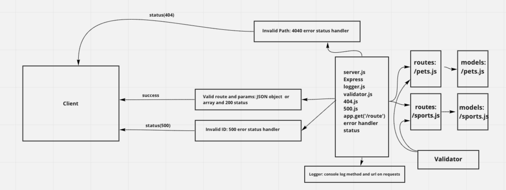

# basic-api-server
I developed a REST API using Express, by creating a proper series of endpoints that perform CRUD operations on a database, using the REST standard.

## Deployed Heroku
- https://basic-api-server.herokuapp.com/

## Github Pull Request(s)
- https://github.com/nickdeans/basic-api-server/pull/2

## UML 
